# Dragon Arena
# Deployment Link
[Dragon Arena Game]()

# Team members
* Amaal Asaad Ibraheem.
* Mohamed Ahmed Ali. 
* Samar Khaled mostafa.

# File Organization
* intro.html : this is Main game INDEX
* Sound folder: Here all Audio data used in Game.
* Img folder:Here all image data used in Game.
* js folder: Here all javaScript files.
* css folder: Here all Stylesheets files.
# project OOP structure

# Game Pages
* ## Start Page
    This is welcome to our Game where here you can See the owner of game and Some instruction details about the Game.
    you Can go to Home page by press any Key.
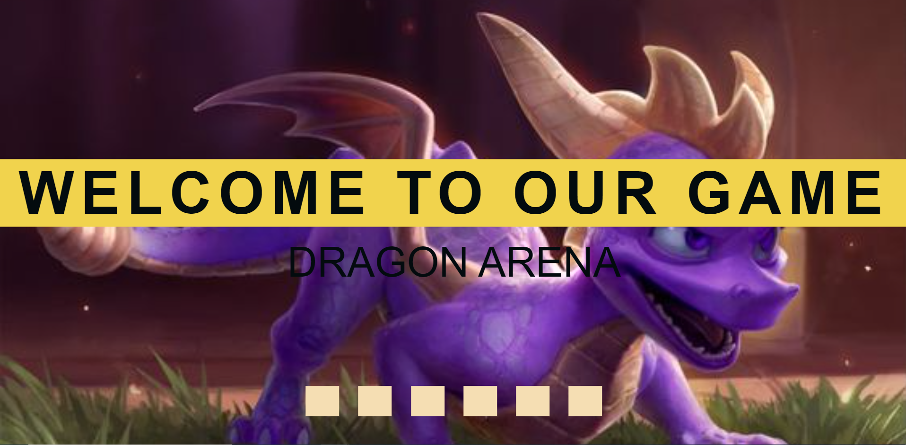

* ## Home Page 
    This is Main home Game.
    you Can start game by click on Play.
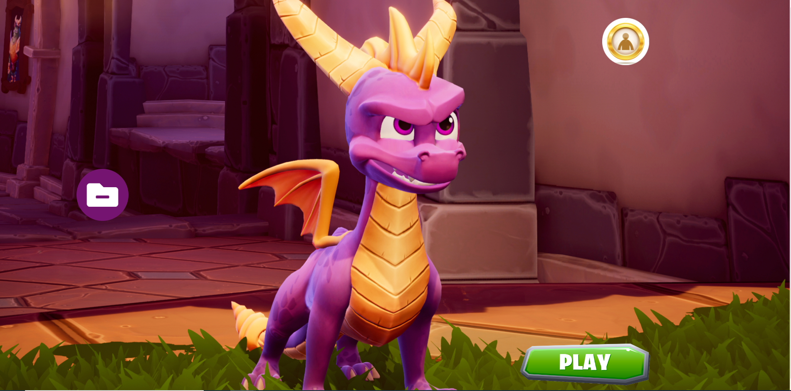

* ## Game Page
    This is game area page where here you can start to play.
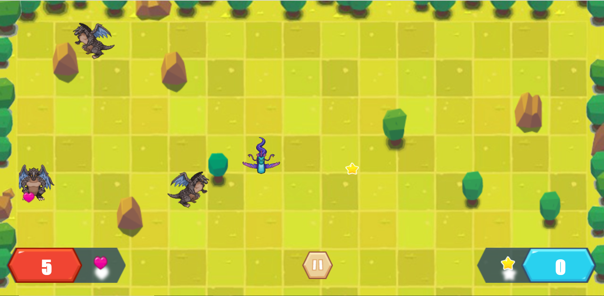

# Game Dom
* ### Owners
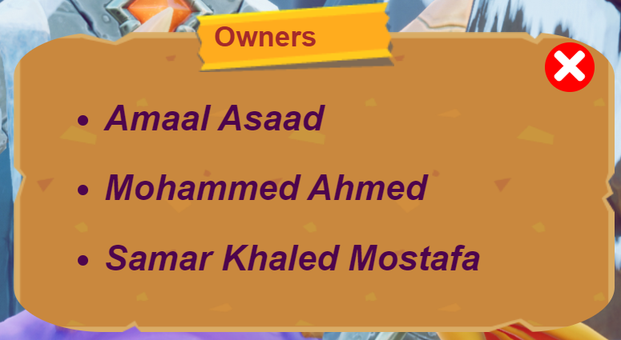

* ### Instructions
    Here display docmentation about game and HOW TO PLAY?
    1. Main Goal
    2. How to play
    3. Power Ups

* ### Control Menue
    Here you can control the game:
    1. pause game
    2. reset level 
    3. back to home again
    4. cotinue playing
    5. open /close background music
    6. open /close game sound effects 
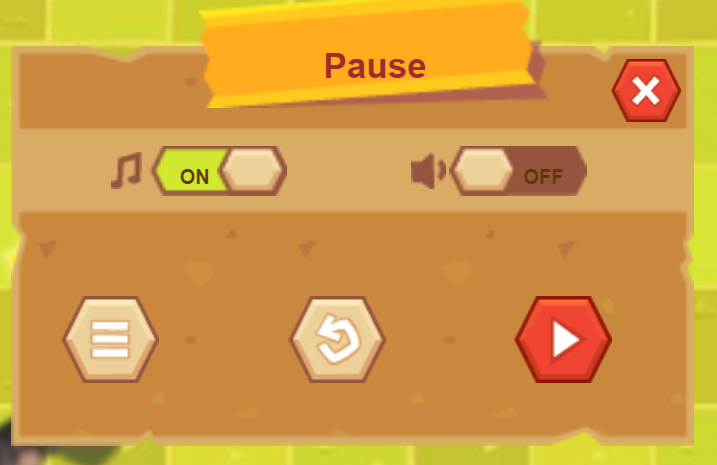

# Game Alerts
* ### Ready to play?
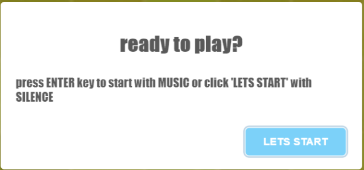
* ### Game Over!
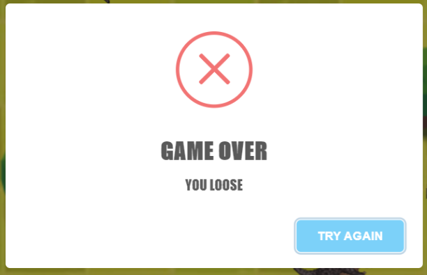
* ### Congratulation Win!
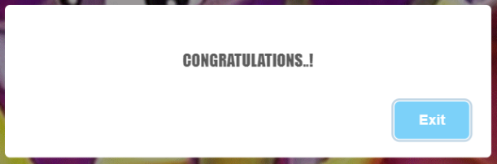
* ### Good Job LEVEL 2
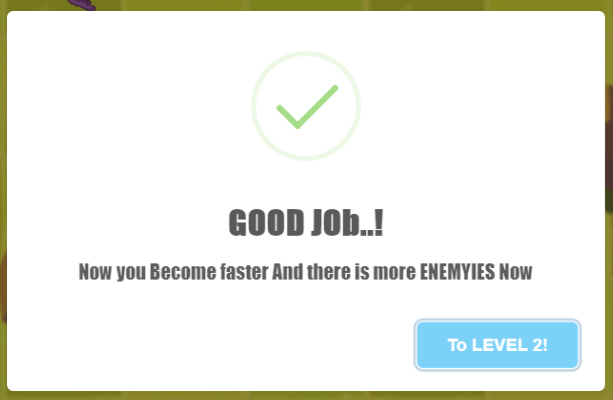
* ### Good Job LEVEL 3
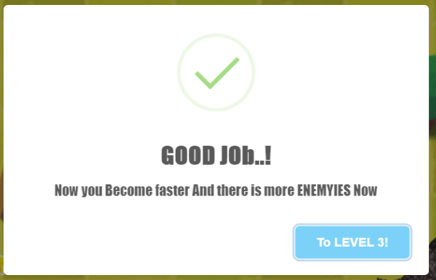
* ### Are you sure to back?
  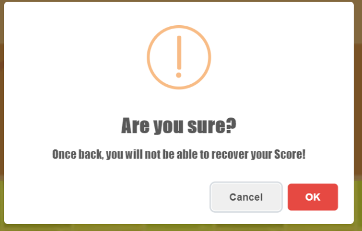
  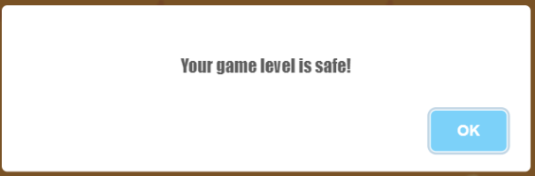

# Game LEVEL
* ## LEVEL 1
### start with 5 lifes,there is 3 enemy, and your speed is slow. 
* ## LEVEL 2
### there is two more enemies there, and your speed is intermidate. 

* ## LEVEL 3
### there is two more enemies there, and your speed is hight. 

